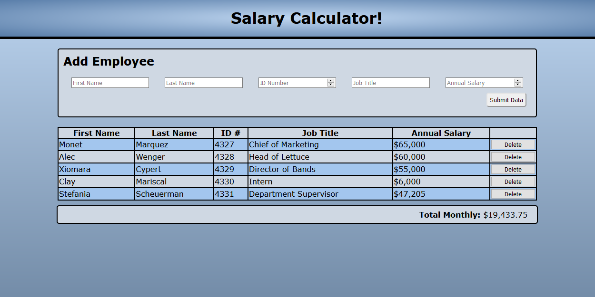

# SALARY CALCULATOR

## Description

_Duration: 2 Days_

This application allows employee data to be added to a table. When salaries are provided for each employee the application will calculate and display the monthly cost of payroll. If the monthly cost is greater than $20,000 the display will turn red to indicate that the expense is too high.

## Screen Shot

## Usage
How does someone use this application? Tell a user story here.

1. Fill in all data fields for each employee (ID numbers must be unique).
2. Press the "Submit Data" button to add the employee to the table.
3. Employees can be removed from the table by clicking the "Delete" button at the end of their rows.
4. The monthly cost is displayed beneath the table.

## Built With

JavaScript, jQuery

## Acknowledgement
Thanks to [Prime Digital Academy](www.primeacademy.io) who equipped and helped me to make this application a reality. (Thank your people)
